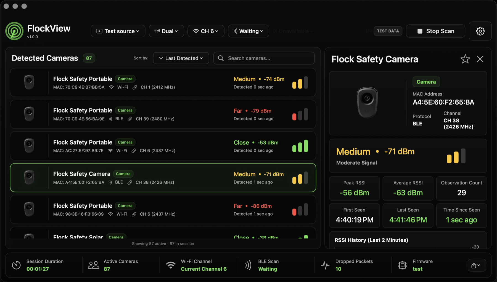
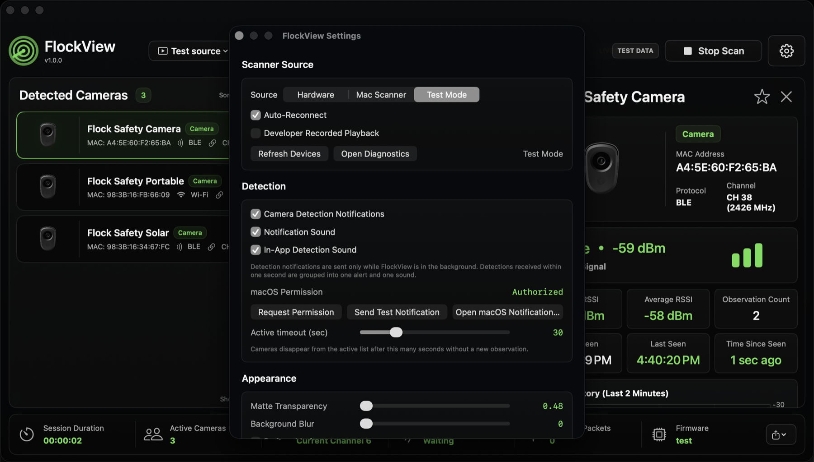
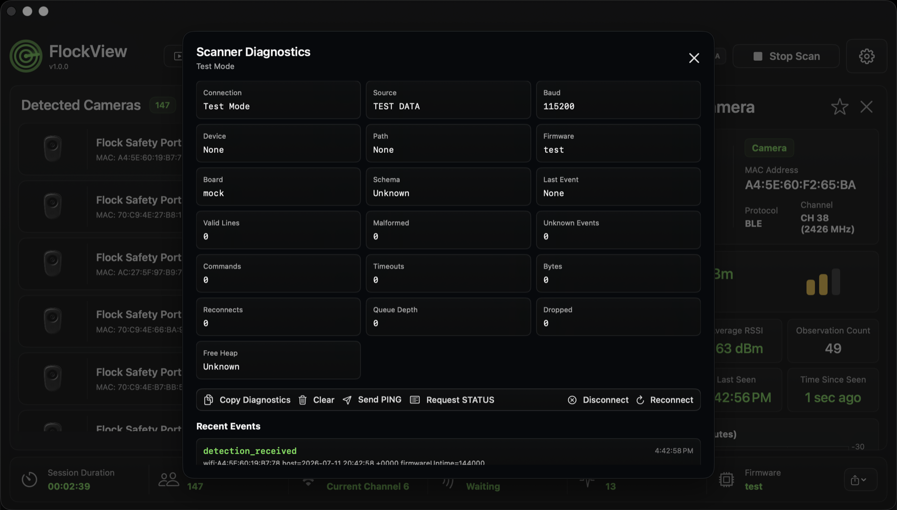

```text
 /$$$$$$$$ /$$                     /$$       /$$    /$$ /$$
| $$_____/| $$                    | $$      | $$   | $$|__/
| $$      | $$  /$$$$$$   /$$$$$$$| $$   /$$| $$   | $$ /$$  /$$$$$$  /$$  /$$  /$$
| $$$$$   | $$ /$$__  $$ /$$_____/| $$  /$$/|  $$ / $$/| $$ /$$__  $$| $$ | $$ | $$
| $$__/   | $$| $$  \ $$| $$      | $$$$$$/  \  $$ $$/ | $$| $$$$$$$$| $$ | $$ | $$
| $$      | $$| $$  | $$| $$      | $$_  $$   \  $$$/  | $$| $$_____/| $$ | $$ | $$
| $$      | $$|  $$$$$$/|  $$$$$$$| $$ \  $$   \  $/   | $$|  $$$$$$$|  $$$$$/$$$$/
|__/      |__/ \______/  \_______/|__/  \__/    \_/    |__/ \_______/ \_____/\___/
```

# FlockView

FlockView is a native macOS scanner console for local Flock camera detection workflows. It can run from the included ESP32 scanner firmware over USB serial, use the Mac's own Wi-Fi and Bluetooth radios, or generate local Test Mode data for demos and UI checks.

The app is built with SwiftUI. It is not Electron, not a web app, and does not need a backend, account, or cloud service.

FlockView is designed around passive observation. It does not connect to, interfere with, impersonate, jam, or modify detected devices.



## Features

- Native macOS SwiftUI interface with a dark, production-ready scanner dashboard.
- Hardware Mode for the included `FlockViewScanner` ESP32-WROOM-32 firmware.
- Mac Scanner mode using CoreWLAN and CoreBluetooth.
- Test Mode with realistic local synthetic detections for demos, screenshots, and UI verification.
- Live detection list with camera type, protocol, channel, MAC address, proximity, RSSI, and last-seen timing.
- Detail inspector with device metadata, signal strength, RSSI history, first/last seen times, and observation counts.
- Multi-signal vendor and signature matching with confidence scoring.
- Flock signature matching shared between the ESP32 path and native Mac scanner where the platform exposes the needed data.
- RSSI smoothing, peak and average signal tracking, proximity labels, and trend analysis.
- Notes and marked-camera state on detections.
- Search, sorting, compact rows, and active-session counters.
- Native macOS notifications for new detections, including grouped alerts and app sound controls.
- JSON and CSV session exports.
- Scanner diagnostics with connection state, firmware version, board, counters, malformed lines, queue state, dropped observations, recent events, and control commands.
- Local-first behavior: detections are not uploaded, synced, or sent to a hosted API.

## Screenshots

| Test Mode Dashboard | Test Mode Settings | Diagnostics |
| --- | --- | --- |
|  |  |  |

## Scanner Modes

### Hardware Mode

Hardware Mode connects to an ESP32-WROOM-32 running the included `FlockViewScanner` firmware. This is the best option for real scanning because the dedicated firmware can observe passive radio metadata continuously and generally provides better range and detection coverage than the Mac-only scanner.

On launch, FlockView discovers serial devices, prefers `/dev/cu.*` ports, waits for serial stabilization, sends `PING`, validates a firmware response, requests `STATUS`, applies the configured scan mode, and starts only when the UI scan state is active.

### Mac Scanner Mode

Mac Scanner mode uses the Mac's local radios:

- CoreWLAN for visible Wi-Fi networks, BSSIDs, SSIDs, channels, and RSSI.
- CoreBluetooth for BLE advertisement names, manufacturer IDs, service UUIDs, and RSSI.

Mac Scanner mode is useful when you do not have the ESP32 connected, but macOS public APIs do not expose every low-level radio field. In particular, CoreBluetooth does not expose BLE MAC addresses, so BLE OUI matching is only available on scanner sources that expose BLE MACs, such as the ESP32 firmware.

### Test Mode

Test Mode generates local synthetic detections and clearly labels the session as `TEST DATA`. It is intended for demos, UI validation, screenshots, notification checks, and export testing. It does not pretend to be live hardware data.

Test Mode includes:

- Single-camera or multi-camera batch generation.
- Configurable detection interval.
- RSSI changes over time.
- Mixed BLE and Wi-Fi examples.
- Real dashboard, detail, notification, diagnostic, and export paths.

## Detection and Vendor Matching

FlockView does not treat a single OUI or vendor match as definitive proof. It combines available evidence such as:

- Vendor and OUI matches for public/static addresses.
- Advertised device names.
- Manufacturer identifiers.
- Service UUIDs.
- Signal strength and RSSI trends.
- Repeated observations.
- Detection method aggregation.
- Confidence scoring.

Randomized or private wireless addresses can limit vendor-identification accuracy. A vendor match alone does not guarantee that a device is a Flock Safety camera. FlockView combines multiple indicators to produce a confidence score.

## Install

Download the official v1.0 release from [GitHub Releases](https://github.com/Arxhsz/FlockView/releases/tag/v1.0.0).

Open `FlockView-macOS.dmg`, then drag `FlockView.app` into `Applications`.

## Flash The ESP32 From The Web

Use the browser flasher at [arxhsz.github.io/FlockView](https://arxhsz.github.io/FlockView/) to install the official FlockViewScanner firmware on an ESP32-WROOM-32 board.

Requirements:

- Chrome, Edge, or another Chromium browser with Web Serial support.
- ESP32-WROOM-32 development board.
- Data-capable USB cable.

The direct firmware application binary is also included at [`docs/firmware/flockview-scanner-v1.0.0.bin`](docs/firmware/flockview-scanner-v1.0.0.bin). The web flasher uses the full ESP32 image set:

```text
docs/firmware/bootloader.bin
docs/firmware/partitions.bin
docs/firmware/flockview-scanner-v1.0.0.bin
```

To create the release package locally:

```bash
chmod +x scripts/package_release.sh
./scripts/package_release.sh
```

The script writes:

```text
build/release/FlockView-macOS.dmg
build/release/FlockView-macOS.zip
```

## Requirements

- macOS 14 Sonoma or newer.
- Xcode with Swift 5.10 or newer for local builds.
- PlatformIO for firmware builds.
- ESP32-WROOM-32, USB data cable, and any USB-UART driver required by your board for Hardware Mode.

## Build The macOS App

Open `FlockView.xcodeproj` in Xcode, select the `FlockView` scheme, and run the macOS app target.

Command-line build:

```bash
xcodebuild -project FlockView.xcodeproj -scheme FlockView -configuration Debug -destination 'platform=macOS' build
```

Command-line tests:

```bash
xcodebuild test -project FlockView.xcodeproj -scheme FlockView -configuration Debug -destination 'platform=macOS'
```

## Build And Flash Firmware

Install PlatformIO, then from `FlockViewScanner/`:

```bash
pio run
pio run --target upload
pio device monitor
pio test
```

Before connecting from the app, verify the board prints JSON Lines in PlatformIO Serial Monitor at `115200` baud. A valid boot line includes:

```json
{"firmware":"FlockViewScanner"}
```

## Supported Firmware Commands

```text
PING
STATUS
START
STOP
MODE DUAL
MODE WIFI
MODE BLE
CLEAR
SET WIFI DWELL <milliseconds>
SET BLE WINDOW <milliseconds>
SET RSSI MIN <value>
SET DEBUG ON
SET DEBUG OFF
```

Each command ends with `\n` and expects a JSON `command_response`.

## Data And Privacy

FlockView is designed as a local scanner console. It does not upload detections, phone home, create accounts, or depend on a hosted API. Session exports are written only when you explicitly export them.

The app displays matched camera detections. Generic BLE beacons, unrelated access points, unclassified observations, scanner status events, and malformed JSON are intentionally not shown as cameras.

## Troubleshooting

### ESP32 Does Not Appear

Use a data-capable USB cable and check for `/dev/cu.*` devices. Common USB-UART names include `cu.SLAB_USBtoUART`, `cu.usbserial-*`, `cu.wchusbserial*`, and `cu.usbmodem*`.

### Port Opens But Handshake Fails

Confirm the firmware is flashed, open PlatformIO Serial Monitor at `115200`, and check that the boot event reports `FlockViewScanner`. Close any other serial monitor before connecting from FlockView.

### No Detections Appear

The app only displays supported Flock camera matches. RSSI is a proximity indicator, not an exact distance, and detections depend on what the scanner source can legally observe.

### App Reconnects Repeatedly

Disable Auto-Reconnect from the ESP32 menu or Settings, unplug and reconnect the board, then connect manually. Diagnostics will show command timeouts, malformed line counts, and recent scanner events.

## Project Layout

```text
FlockView/         macOS SwiftUI app
FlockViewScanner/  ESP32 PlatformIO firmware
FlockViewTests/    XCTest coverage
docs/              GitHub Pages web flasher, firmware binaries, README images
scripts/           Release packaging tools
```

## Author

Made by [arxhsz](https://github.com/Arxhsz).
