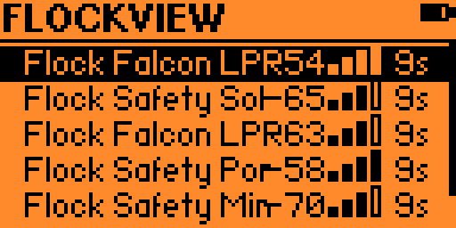

```text
 /$$$$$$$$ /$$                     /$$       /$$    /$$ /$$
| $$_____/| $$                    | $$      | $$   | $$|__/
| $$      | $$  /$$$$$$   /$$$$$$$| $$   /$$| $$   | $$ /$$  /$$$$$$  /$$  /$$  /$$
| $$$$$   | $$ /$$__  $$ /$$_____/| $$  /$$/|  $$ / $$/| $$ /$$__  $$| $$ | $$ | $$
| $$__/   | $$| $$  \ $$| $$      | $$$$$$/  \  $$ $$/ | $$| $$$$$$$$| $$ | $$ | $$
| $$      | $$| $$  | $$| $$      | $$_  $$   \  $$$/  | $$| $$_____/| $$ | $$ | $$
| $$      | $$|  $$$$$$/|  $$$$$$$| $$ \  $$   \  $/   | $$|  $$$$$$$|  $$$$$/$$$$/
|__/      |__/ \______/  \_______/|__/  \__/    \_/    |__/ \_______/ \_____/\___/
```

# FlockView

FlockView is a native macOS application and ESP32-based passive wireless scanner designed to identify likely Flock Safety camera infrastructure using vendor signatures, signal analysis, repeated observations, and confidence-based matching. The app keeps each scan session local to the Mac running it.

No Electron. No browser serial API. No backend. No cloud account.

## FlockView macOS App



## Features

- Native SwiftUI macOS scanner dashboard.
- ESP32-WROOM-32 scanner firmware with USB serial communication.
- Hardware, Mac Scanner, Test, and Recorded Playback sources.
- Wi-Fi and BLE observation processing.
- Vendor and signature matching using multiple indicators.
- RSSI smoothing, peak and average signal tracking, proximity labels, and trend analysis.
- Detection confidence scoring and method aggregation.
- Native macOS notifications and in-app detection sounds.
- JSON and CSV session exports.
- Diagnostics for scanner health, malformed input, command timeouts, dropped observations, and queue depth.

## How FlockView Works

FlockView accepts observations from the included ESP32 scanner or from supported native macOS scanning APIs. Observations are normalized, classified, grouped into device records, and displayed only when they meet the configured matching criteria.

The project is designed around passive observation. FlockView does not connect to, interfere with, impersonate, jam, or modify detected devices.

## ESP32 Scanner

The maintained firmware is located in `FlockViewScanner/`. It communicates with the macOS app over USB serial at `115200` baud and emits structured JSON Lines events for boot state, scanner status, detections, command responses, and errors.

Supported operating modes:

- Dual Wi-Fi and BLE scanning
- Wi-Fi-only scanning
- BLE-only scanning
- Stopped/idle state

## Detection and Vendor Matching

FlockView does not treat a single OUI or vendor match as definitive proof. It combines available evidence such as:

- Vendor and OUI matches for public/static addresses
- Advertised device names
- Manufacturer identifiers
- Service UUIDs
- Signal strength and RSSI trends
- Repeated observations
- Detection method aggregation
- Confidence scoring

Randomized or private wireless addresses can limit vendor-identification accuracy. A vendor match alone does not guarantee that a device is a Flock Safety camera. FlockView combines multiple indicators to produce a confidence score.

macOS does not expose BLE MAC addresses through public CoreBluetooth APIs. Native BLE matching therefore relies on advertisement name, manufacturer data, service UUIDs, and RSSI evidence instead of BLE OUI matching.

## Requirements

- macOS 14 Sonoma or newer
- Xcode with Swift 5.10 or newer
- ESP32-WROOM-32 for Hardware Mode
- USB data cable
- Appropriate USB-UART driver if macOS does not already include one
- PlatformIO for firmware builds

Mac Scanner mode can run without the ESP32, but macOS may request Bluetooth and Location permission. Location permission is required because macOS gates Wi-Fi SSID and BSSID scan results behind it.

## Installation

The release package is a normal macOS `.dmg`. Open it and drag `FlockView.app` into `Applications`.

To create the release package locally:

```bash
chmod +x scripts/package_release.sh
./scripts/package_release.sh
```

The script writes:

```text
build/release/FlockView-macOS.dmg
build/release/FlockView-macOS.zip
```

## Building the macOS App

Open `FlockView.xcodeproj` in Xcode, select the `FlockView` scheme, and run the macOS app target.

Command-line build:

```bash
xcodebuild -project FlockView.xcodeproj -scheme FlockView -configuration Debug -destination 'platform=macOS' build
```

Command-line tests:

```bash
xcodebuild test -project FlockView.xcodeproj -scheme FlockView -configuration Debug -destination 'platform=macOS'
```

## Building the ESP32 Firmware

From `FlockViewScanner/`:

```bash
pio run
pio run --target upload
pio device monitor
pio test
```

Before connecting from the app, verify that the board emits JSON Lines in PlatformIO Serial Monitor at `115200` baud. A valid boot line includes:

```json
{"firmware":"FlockViewScanner"}
```

## Usage

Hardware Mode discovers serial devices, prefers `/dev/cu.*` ports, waits for serial stabilization, sends `PING`, validates the firmware response, requests `STATUS`, applies the selected scan mode, and begins scanning only when the UI scan state is active.

Mac Scanner mode uses CoreWLAN for visible Wi-Fi networks and CoreBluetooth for BLE advertisements. Test Mode generates clearly labeled synthetic detections for UI verification. Recorded Playback replays bundled scanner fixtures for development.

Supported firmware commands:

```text
PING
STATUS
START
STOP
MODE DUAL
MODE WIFI
MODE BLE
CLEAR
SET WIFI DWELL <milliseconds>
SET BLE WINDOW <milliseconds>
SET RSSI MIN <value>
SET DEBUG ON
SET DEBUG OFF
```

## Project Structure

```text
FlockView/
├── FlockView/          # Native macOS Swift application
├── FlockViewScanner/   # Maintained ESP32 scanner firmware
├── FlockViewTests/     # XCTest coverage
├── docs/
│   └── assets/         # macOS application screenshot
├── scripts/            # Release packaging tools
├── README.md
└── RELEASE.md
```

## Privacy and Responsible Use

FlockView keeps scanner sessions local. It does not upload detections, create accounts, phone home, or depend on a hosted API. Session exports are created only when the user explicitly requests them.

Use FlockView only where passive observation is lawful and authorized. RSSI is a proximity indicator, not an exact distance measurement, and classification results should be treated as confidence-based estimates rather than definitive identification.

## Known Limitations

- Randomized BLE addresses may prevent OUI-based vendor identification.
- macOS CoreBluetooth does not expose BLE MAC addresses.
- Signal strength varies with antenna orientation, obstructions, radio conditions, and hardware.
- A matching vendor or signature is not by itself proof of device identity.
- Detection quality depends on the evidence available to the selected scanner source.

## Release Information

See [RELEASE.md](RELEASE.md) for the current release summary and packaging instructions.

## Author

Made by [arxhsz](https://github.com/Arxhsz).
