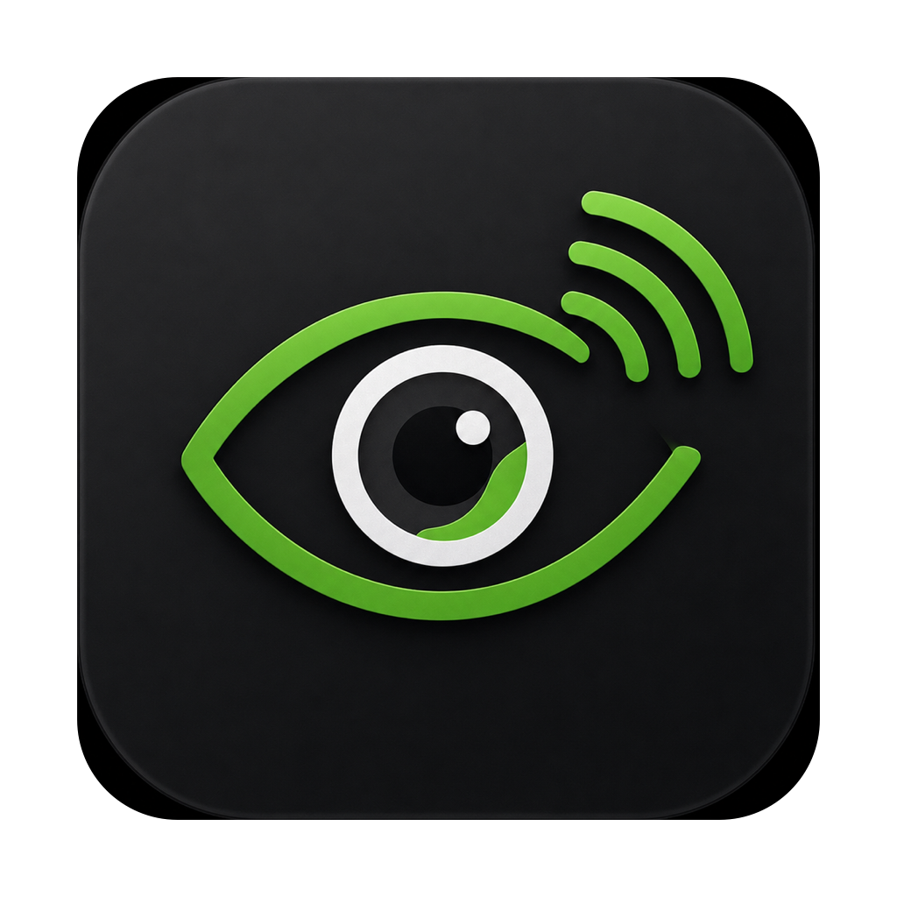
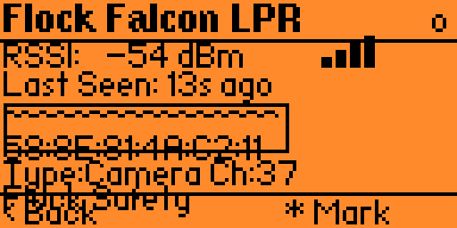
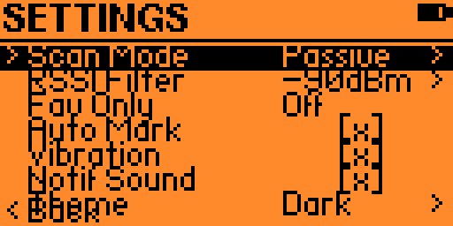

<p align="center">
  
</p>

# FlockView

FlockView is a native macOS scanner console for passive Flock camera detection workflows. It talks to the included ESP32-WROOM-32 firmware over USB serial, can also scan with the Mac's own Wi-Fi and Bluetooth radios, and keeps every session local to the machine running the app.

No Electron. No browser serial API. No backend. No cloud account.


## What It Does

- Connects to `FlockViewScanner` firmware over USB serial at `115200` baud.
- Verifies the scanner with a JSON handshake before showing it as connected.
- Groups matching camera detections into a clean SwiftUI dashboard.
- Supports Hardware, Mac Scanner, Test, and Recorded Playback sources without mixing session data.
- Uses native macOS notifications and an in-app detection sound for new camera detections.
- Exports session data as JSON or CSV.
- Keeps diagnostics visible for firmware status, malformed lines, command timeouts, queue depth, dropped observations, and scanner health.

## Screenshots

| Dashboard | Settings | Diagnostics |
| --- | --- | --- |
|  |  |  |

## Requirements

- macOS 14 Sonoma or newer
- Xcode with Swift 5.10 or newer
- ESP32-WROOM-32 for Hardware Mode
- USB data cable and the USB-UART driver required by your board, if macOS does not already include it
- PlatformIO for firmware builds

Mac Scanner mode can run without the ESP32, but macOS may ask for Bluetooth and Location permission. Location is only needed because macOS gates Wi-Fi SSID and BSSID scan results behind that permission.

## Install The App

The release package is a normal macOS `.dmg`. Open it, then drag `FlockView.app` into `Applications`.

If you are building locally, create the same release package with:

```bash
chmod +x scripts/package_release.sh
./scripts/package_release.sh
```

The script writes:

```text
build/release/FlockView-macOS.dmg
build/release/FlockView-macOS.zip
```

Use the `.dmg` for a drag-to-Applications install. The `.zip` is included as a plain app bundle archive for people who prefer downloading and moving the app manually.

## Build The macOS App

Open `FlockView.xcodeproj` in Xcode, select the `FlockView` scheme, and run the macOS app target.

Command-line build:

```bash
xcodebuild -project FlockView.xcodeproj -scheme FlockView -configuration Debug -destination 'platform=macOS' build
```

Command-line tests:

```bash
xcodebuild test -project FlockView.xcodeproj -scheme FlockView -configuration Debug -destination 'platform=macOS'
```

Use a normally signed local build when testing macOS notifications. A compile-only unsigned build can launch, but macOS may not list it correctly in System Settings > Notifications.

## Build And Flash Firmware

Install PlatformIO, then from `FlockViewScanner/`:

```bash
pio run
pio run --target upload
pio device monitor
pio test
```

Before connecting from the app, verify the board prints JSON Lines in PlatformIO Serial Monitor at `115200` baud. A valid boot line includes:

```json
{"firmware":"FlockViewScanner"}
```

## Scanner Sources

Hardware Mode is the default. FlockView discovers serial devices, prefers `/dev/cu.*` ports, waits for serial stabilization, sends `PING`, validates a firmware response, requests `STATUS`, applies the configured scan mode, and starts only when the UI scan state is active.

Mac Scanner mode uses CoreWLAN for visible Wi-Fi networks and CoreBluetooth for BLE advertisements. It reuses the same Flock signature and classifier rules as the ESP32 path where macOS exposes enough evidence. macOS does not expose BLE MAC addresses through public CoreBluetooth APIs, so native BLE matching uses advertisement name, manufacturer, service UUID, and RSSI evidence instead of BLE OUI matching.

Test Mode generates synthetic local detections for UI verification and is clearly labeled `TEST DATA`. Recorded Playback replays bundled firmware-like JSON fixtures for development.

## Supported Firmware Commands

```text
PING
STATUS
START
STOP
MODE DUAL
MODE WIFI
MODE BLE
CLEAR
SET WIFI DWELL <milliseconds>
SET BLE WINDOW <milliseconds>
SET RSSI MIN <value>
SET DEBUG ON
SET DEBUG OFF
```

Each command ends with `\n` and expects a JSON `command_response`.

## Data And Privacy

FlockView is designed as a local scanner console. It does not upload detections, phone home, create accounts, or depend on a hosted API. Session exports are written only when you explicitly export them.

The app displays matched camera detections. Generic BLE beacons, unrelated access points, unclassified observations, scanner status events, and malformed JSON are intentionally not shown as cameras.

## Troubleshooting

### ESP32 Does Not Appear

Use a data-capable USB cable and check for `/dev/cu.*` devices. Common USB-UART names include `cu.SLAB_USBtoUART`, `cu.usbserial-*`, `cu.wchusbserial*`, and `cu.usbmodem*`.

### Port Opens But Handshake Fails

Confirm the firmware is flashed, open PlatformIO Serial Monitor at `115200`, and check that the boot event reports `FlockViewScanner`. Close any other serial monitor before connecting from FlockView.

### No Detections Appear

The app only displays supported Flock camera matches. RSSI is a proximity indicator, not an exact distance, and detections depend on what the scanner source can legally observe.

### App Reconnects Repeatedly

Disable Auto-Reconnect from the ESP32 menu or Settings, unplug and reconnect the board, then connect manually. Diagnostics will show command timeouts, malformed line counts, and recent scanner events.

## Release Notes

See [RELEASE.md](RELEASE.md) for the current app release summary and packaging instructions.

## Project Layout

```text
FlockView/                 macOS SwiftUI app
FlockViewScanner/          ESP32 Arduino/PlatformIO firmware
FlockViewScannerWROOM32D/  ESP-IDF WROOM-32D firmware variant
FlockViewTests/            XCTest coverage
docs/assets/               README images from the real app
scripts/                   Release packaging tools
```

## Author

Made by [arxhsz](https://github.com/Arxhsz).
